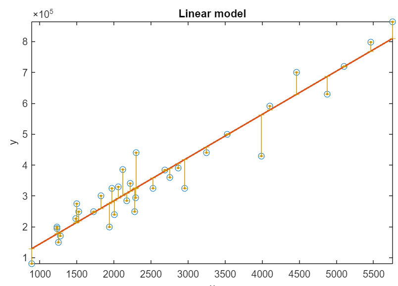

# Regression Basics

 or 

**Curriculum Module**

_Created with R2024b. Compatible with R2024b and later releases._

# Information

This curriculum module contains an interactive [MATLAB® live script](https://www.mathworks.com/products/matlab/live-editor.html) that illustrates some basic concepts of regression analysis.

## Background

You can use this live script as a demonstration in lectures, a class activity, or an interactive assignment outside class. This module covers topics including solving for linear regression parameters, assessing and improving performance of regression models, and applying the gradient descent algorithm. It also includes an example of using a linear regression model to perform short\-term forecasting.

The instructions inside the live script will guide you through the exercises and activities. Get started with the live script by running it one section at a time. To stop running the script or a section midway (for example, when an animation is in progress), use the  Stop button in the **RUN** section of the **Live Editor** tab in the MATLAB Toolstrip.

## Contact Us

Solutions are available upon instructor request. Contact the [MathWorks teaching resources team](mailto:onlineteaching@mathworks.com) if you would like to request solutions, provide feedback, or if you have a question.

## Prerequisites

This module assumes knowledge of plotting and working with linear data.

## Getting Started
### Accessing the Module
### **On MATLAB Online:**

Use the  link to download the module. You will be prompted to log in or create a MathWorks account. The project will be loaded, and you will see an app with several navigation options to get you started.

### **On Desktop:**

Download or clone this repository. Open MATLAB, navigate to the folder containing these scripts and double\-click on [RegressionBasics.prj](RegressionBasics.prj). It will add the appropriate files to your MATLAB path and open an app that asks you where you would like to start. 

Ensure you have all the required products (listed below) installed. If you need to include a product, add it using the Add\-On Explorer. To install an add\-on, go to the **Home** tab and select   **Add-Ons** > **Get Add-Ons**. 

## Products

MATLAB® is used throughout. Tools from Statistics and Machine Learning Toolbox™ are used frequently as well. Parallel Computing Toolbox™ is used specifically for the [parpool](https://www.mathworks.com/help/parallel-computing/parpool.html) function.

# Scripts

 *If you are viewing this in a version of MATLAB prior to R2023b, you can view the learning outcomes for each script* [*here*](https://www.mathworks.com/matlabcentral/fileexchange/93435-regression-basics)

## [**RegressionBasics.mlx**](Scripts/RegressionBasics.mlx)
|      |      |
| :-- | :-- |
|     | **In this script, students will...**   $\bullet$ Use least squares to solve for linear regression paramaters   $\bullet$ Use a goodness\-of\-fit measure to assess model performance   $\bullet$ Apply a basic linear regression to model real\-world electricity load data     |
|      |       |

# Related Courseware Modules
## [**Machine Learning for Regression**](https://www.mathworks.com/matlabcentral/fileexchange/95903-machine-learning-for-regression)
|      |      |
| :-- | :-- |
|     | **Available on:**      [GitHub](https://github.com/MathWorks-Teaching-Resources/Machine-Learning-for-Regression)     |
|      |       |

## [**Machine Learning Methods: Clustering**](https://www.mathworks.com/matlabcentral/fileexchange/135381-machine-learning-methods-clustering)
|      |      |
| :-- | :-- |
|     | **Available on:**      [GitHub](https://github.com/MathWorks-Teaching-Resources/Machine-Learning-Methods-Clustering)     |
|      |       |

Or feel free to explore our other [modular courseware content](https://www.mathworks.com/matlabcentral/fileexchange/?q=tag%3A%22courseware+module%22&sort=downloads_desc_30d).

# Educator Resources
-  [Educator Page](https://www.mathworks.com/academia/educators.html) 

# Contribute 

Looking for more? Find an issue? Have a suggestion? Please contact the [MathWorks teaching resources team](mailto:%20onlineteaching@mathworks.com). If you want to contribute directly to this project, you can find information about how to do so in the [CONTRIBUTING.md](https://github.com/MathWorks-Teaching-Resources/Regression-Basics/blob/release/CONTRIBUTING.md) page on GitHub.

 *©* Copyright 2023 The MathWorks™, Inc

