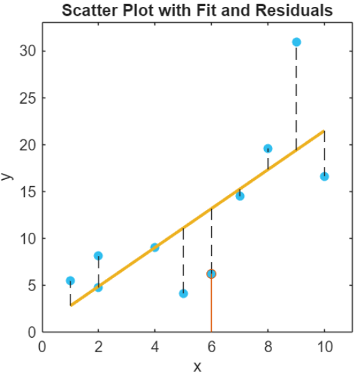
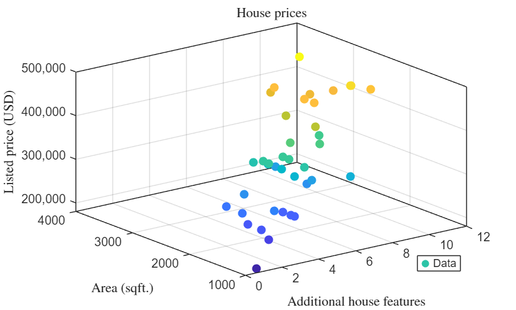
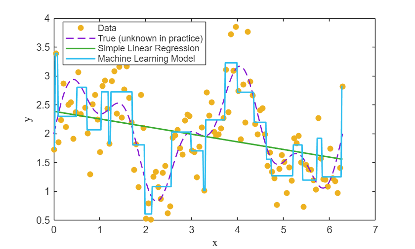

# Regression Basics

 or 

**Curriculum Module**

_Created with R2026a. Compatible with R2026a and later releases._

# Information

This curriculum module contains an interactive [MATLAB® live script](https://www.mathworks.com/products/matlab/live-editor.html) that illustrates some basic concepts of regression analysis.

## Background

You can use this live script as a demonstration in lectures, a class activity, or an interactive assignment outside class. This module covers topics including simple regression, multiple regression, and curvilinear regression applied to engineering topics.

The instructions inside the live script will guide you through the exercises and activities. Get started with the live script by running it one section at a time. To stop running the script or a section midway (for example, when an animation is in progress), use the  Stop button in the **RUN** section of the **Live Editor** tab in the MATLAB Toolstrip.

## Contact Us

Contact the [MathWorks Educator Content Development Team](mailto:onlineteaching@mathworks.com) if you would like to provide feedback, or if you have a question.

## Prerequisites

This module assumes knowledge of plotting and working with linear data, basic programming in MATLAB, knowledge of multivariate calculus and familiarity with linear algebra. 

## Getting Started

### Accessing the Module

### **On MATLAB Online:**

Use the  link to download the module. You will be prompted to log in or create a MathWorks account. The project will be loaded, and you will see an app with several navigation options to get you started.

### **On Desktop:**

Download or clone this repository. Open MATLAB, navigate to the folder containing these scripts and double\-click on [RegressionBasics.prj](RegressionBasics.prj). It will add the appropriate files to your MATLAB path and open an app that asks you where you would like to start. 

Ensure you have all the required products ([listed below](#H_E850B4FF)) installed. If you need to include a product, add it using the Add\-On Explorer. To install an add\-on, go to the **Home** tab and select   **Add-Ons** > **Get Add-Ons**. 

## Products

MATLAB® is used throughout. Tools from Statistics and Machine Learning Toolbox™, Curve Fitting Toolbox™, and Symbolic Math Toolbox™. are used frequently as well.

# Scripts

## [**Linear Regression**](https://matlab.mathworks.com/open/github/v1?repo=MathWorks-Teaching-Resources/regression-basics&project=RegressionBasics.prj&file=Scripts/LinearRegression.mlx)
||||
| :-- | :-- | :-- |
|     | **In this script, students will...**   $\bullet$ explain and apply simple linear regression models.   $\bullet$ evaluate and interpret regression results using residuals and model coefficients.   $\bullet$ build multiple linear regression models and assess model fit using visual and analytical methods.    | **Academic disciplines**   $\bullet$ Math   $\bullet$ Statistics   $\bullet$ Data Science   $\bullet$ Biomedical Devices   $\bullet$ Machine Learning     |

## [ **Curvilinear Regression**](https://matlab.mathworks.com/open/github/v1?repo=MathWorks-Teaching-Resources/regression-basics&project=RegressionBasics.prj&file=Scripts/CurvilinearRegression.mlx)
||||
| :-- | :-- | :-- |
|     | **In this script, students will...**   $\bullet$ explain curvilinear regression and when to use it.   $\bullet$ distinguish and apply polynomial and linearizable nonlinear models.   $\bullet$ explain curvilinear regression and identify contexts where it is most suitable.    | **Academic disciplines**   $\bullet$ Math   $\bullet$ Statistics   $\bullet$ Data Science   $\bullet$ Machine Learning   $\bullet$ Electrochemistry/Chemical Engineering   $\bullet$ Electrical Engineering     |

## [**Multiple Regression**](https://matlab.mathworks.com/open/github/v1?repo=MathWorks-Teaching-Resources/regression-basics&project=RegressionBasics.prj&file=Scripts/MultipleRegression.mlx)
||||
| :-- | :-- | :-- |
|     | **In this script, students will...**   $\bullet$ explain multiple linear regression and identify response and predictor variables.  $\bullet$ check linearity assumptions using scatterplots and residual diagnostics.   $\bullet$  fit and use a multiple regression model to interpret coefficients and make predictions.    | **Academic disciplines**   $\bullet$ Math   $\bullet$ Statistics   $\bullet$ Data Science   $\bullet$ Machine Learning   $\bullet$ Chemical Engineering   $\bullet$ Electrical Engineering     |

# Related Courseware Modules

## [**Machine Learning for Regression**](https://www.mathworks.com/matlabcentral/fileexchange/95903-machine-learning-for-regression)
|||
| :-- | :-- |
|     | **Available on:**      [GitHub](https://github.com/MathWorks-Teaching-Resources/Machine-Learning-for-Regression)     |

## [**Machine Learning Methods: Clustering**](https://www.mathworks.com/matlabcentral/fileexchange/135381-machine-learning-methods-clustering)
|||
| :-- | :-- |
|     | **Available on:**      [GitHub](https://github.com/MathWorks-Teaching-Resources/Machine-Learning-Methods-Clustering)     |

Or feel free to explore our other [modular courseware content](https://www.mathworks.com/matlabcentral/fileexchange/?q=tag%3A%22courseware+module%22&sort=downloads_desc_30d).

# Educator Resources
- [Educator Page](https://www.mathworks.com/academia/educators.html)

# Contribute 

Looking for more? Find an issue? Have a suggestion? Please contact the [MathWorks Educator Content Development Team](mailto:%20onlineteaching@mathworks.com). If you want to contribute directly to this project, you can find information about how to do so in the [CONTRIBUTING.md](https://github.com/MathWorks-Teaching-Resources/Regression-Basics/blob/release/CONTRIBUTING.md) page on GitHub.

 *©* Copyright 2026 The MathWorks, Inc
